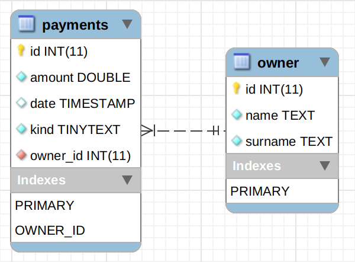
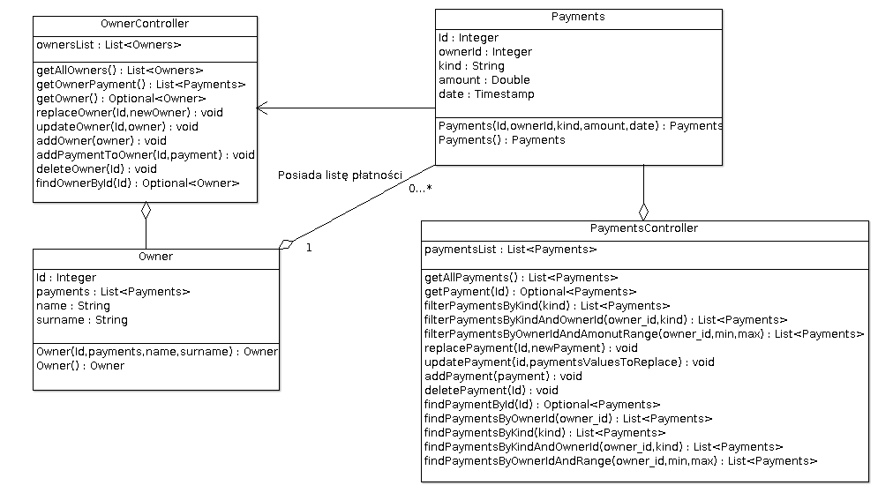

# Getting Started

### Reference Documentation
For further reference, please consider the following sections:

* [Official Apache Maven documentation](https://maven.apache.org/guides/index.html)
* [Spring Boot Maven Plugin Reference Guide](https://docs.spring.io/spring-boot/docs/2.2.1.RELEASE/maven-plugin/)
* [Spring Web](https://docs.spring.io/spring-boot/docs/2.2.1.RELEASE/reference/htmlsingle/#boot-features-developing-web-applications)
* [Thymeleaf](https://docs.spring.io/spring-boot/docs/2.2.1.RELEASE/reference/htmlsingle/#boot-features-spring-mvc-template-engines)
* [Spring Data JPA](https://docs.spring.io/spring-boot/docs/2.2.1.RELEASE/reference/htmlsingle/#boot-features-jpa-and-spring-data)
* [Spring Security](https://docs.spring.io/spring-boot/docs/2.2.1.RELEASE/reference/htmlsingle/#boot-features-security)
* [Spring HATEOAS](https://docs.spring.io/spring-boot/docs/2.2.1.RELEASE/reference/htmlsingle/#boot-features-spring-hateoas)

### Guides
The following guides illustrate how to use some features concretely:

* [Building a RESTful Web Service](https://spring.io/guides/gs/rest-service/)
* [Serving Web Content with Spring MVC](https://spring.io/guides/gs/serving-web-content/)
* [Building REST services with Spring](https://spring.io/guides/tutorials/bookmarks/)
* [Handling Form Submission](https://spring.io/guides/gs/handling-form-submission/)
* [Accessing data with MySQL](https://spring.io/guides/gs/accessing-data-mysql/)
* [Accessing Data with JPA](https://spring.io/guides/gs/accessing-data-jpa/)
* [Securing a Web Application](https://spring.io/guides/gs/securing-web/)
* [Spring Boot and OAuth2](https://spring.io/guides/tutorials/spring-boot-oauth2/)
* [Authenticating a User with LDAP](https://spring.io/guides/gs/authenticating-ldap/)
* [Building a Hypermedia-Driven RESTful Web Service](https://spring.io/guides/gs/rest-hateoas/)

### Database CALC_BILL

##### Structure:
* owner

        +---------+---------+------+-----+---------+----------------+
        | Field   | Type    | Null | Key | Default | Extra          |
        +---------+---------+------+-----+---------+----------------+
        | id      | int(11) | NO   | PRI | NULL    | auto_increment |
        | name    | text    | NO   |     | NULL    |                |
        | surname | text    | NO   |     | NULL    |                |
        +---------+---------+------+-----+---------+----------------+
        
* payments

        +----------+-----------+------+-----+-------------------+-------------------+
        | Field    | Type      | Null | Key | Default           | Extra             |
        +----------+-----------+------+-----+-------------------+-------------------+
        | id       | int       | NO   | PRI | NULL              | auto_increment    |
        | amount   | double    | NO   |     | NULL              |                   |
        | date     | timestamp | YES  |     | CURRENT_TIMESTAMP | DEFAULT_GENERATED |
        | kind     | tinytext  | NO   |     | NULL              |                   |
        | owner_id | int       | YES  | MUL | NULL              |                   |
        +----------+-----------+------+-----+-------------------+-------------------+

##### Relations:

### Diagram class UML
 
#### pl.cecherz.calcbill.controller.json.v1
